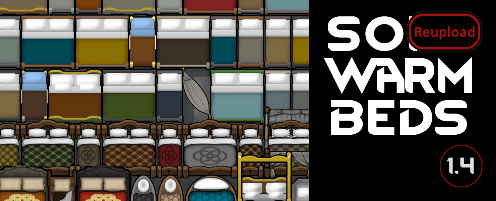

# [JPT] Soft Warm Beds
A bed expansion for RimWorld.

[**>>> DOWNLOAD IT HERE <<<**](https://github.com/jptrrs/SoftWarmBeds/releases/latest)

Have you ever wondered why is it that we just need stone blocks or steel to build a bed, while wool and furs pile up in the warehouse, unused? Do you get a feeling it would be way more comfortable to lay down on something soft? And what if that cozy bed could also help with the freezing cold? Well, that's what this mod is all about!

Now your beds will only provide full comfort if you add some mattress, pillows and a blanket - or a bedding set, to simplify. <b>These can be made at your regular tailor bench or crafting spot</b> after researching complex furniture. And depending on what they are made of, your beds can get even <i>more</i> comfortable than the regular ones, affecting their effectiveness in providing rest as well. Also, the material insulation properties carries over to the bed, helping keep your pawns warm and, therefore, <b>helping to prevent negative thoughts when sleeping in cold</b>.

But blankets, of course, can't help with the heat. For those playing on tropical climates, we included a tropical alternative to beds: <i>hammocks</i>! How come nobody thought of that before? These cheap hanging rigs may not be as comfortable as a full bed, but they do help cooling off. And being cheap and light, they can also be used as travel beds, just like bedrolls!

This is how it works, in detail:

<h2>First, all beds get more complicated</h2>

When you load the mod, all vanilla game beds are modified. First, their comfort and rest effectiveness stats are drastically reduced, to the point that a poor bed might not be much more confortable than sleeping on the ground (check the table for the numbers). To accommodate for that, the sleeping spot is downgraded as well: zero comfort and reduced rest effectiveness, down to 30%. <b>This means that if your pawns are forced to sleep on the floor and you don't assign proper work hours for them, they will be useless for the better part of the day!</b> That makes it even more important to build beds as soon as possible.

But in order to get really comfy ones, you must equip them with beddings. They come in two sizes - single and double - and can be made out of textiles on the crafting spot or tailor benches after researching complex furniture. You select which goes on what bed on the new "make bed" button. They not only provide a bed color to your interior design efforts, but also add some cold insulation and bump up comfort and rest effectiveness. That's based on the material they're made of and the bed quality.

You don't need to add anything to Bedrolls and Hammocks, of course. They get their buff directly from the textile they are made of (and yes, that means a bedroll might be more comfortable than a bed without a mattress, just like real life!). And unlike the other beds, hammocks use their material's <i>heat</i> insulation properties, making them a true tropical alternative (even if they're not big enough for couples to sleep comfortably together).

<h2>The softness stat</h2>
To measure how much a material can contribute to a bed's comfort and rest effectiveness, the mod implements a new stat. The softness of every textile is calculated on startup, taking into account its armor capabilities as a measure for hardness, its temperature offsets as a measure of how much fur is involved, and their price point as a measure of how luxurious it is. This is applied to every textile, even the ones added by other mods (so you can even make a hemp blanket if you want to!).

The result is that hard leathers and space-age synthetic fabrics, which are usually good for armor, are not that desirable to put on your bed. On the other hand, those weak fabrics that have a tendency to pile up as the game progresses, such as cloth and wool, make the best beddings. Check the table for the softness of vanilla textiles.

<h2>Compatibility</h2>
You can safely add this to your saved game. Beware: all existing beds will get a lot less effective until you craft appropriate beddings. If you wish to remove it, just delete any bedding bills on tailor benches or crafting spots before you do it.

Compatible with:
<ul>
<li><a href="https://steamcommunity.com/sharedfiles/filedetails/?id=1641239442">Baby & Children</a>
</li><li><a href="https://steamcommunity.com/sharedfiles/filedetails/?id=1558635181">GloomyFurniture</a>, <a href="https://steamcommunity.com/sharedfiles/filedetails/?id=1697864590">Gloomy Vanilla</a> & <a href="https://steamcommunity.com/sharedfiles/filedetails/?id=1883678698">Gloomy Vanilla Overhaul</a> (please, unmake and redo all previous beds for the new textures to roll out.)
</li><li><a href="https://steamcommunity.com/sharedfiles/filedetails/?id=1447372624">Nano Repair Tech</a>
</li><li><a href="https://steamcommunity.com/sharedfiles/filedetails/?id=753498552">Orion's Hospitality</a> (from version 1.0.34)
</li><li><a href="https://steamcommunity.com/sharedfiles/filedetails/?id=2008138191">Polyamory Beds</a> (on their side, thanks to Meltup)
</li><li><a href="https://steamcommunity.com/sharedfiles/filedetails/?id=1610302046">Rice Cultivating Civilization</a>
</li><li><a href="https://steamcommunity.com/sharedfiles/filedetails/?id=769201959">RIMkea</a> 
</li><li><a href="https://steamcommunity.com/sharedfiles/filedetails/?id=1123043922">Sparkling Worlds</a> (Full & Core) 
</li><li><a href="https://steamcommunity.com/sharedfiles/filedetails/?id=1718190143">Vanilla Furniture Expanded</a> (Core, Medical & Spacer modules).
</li></ul>

If you are using <a href="https://steamcommunity.com/sharedfiles/filedetails/?id=1552507180">Psychology</a>, watch out for insomniac colonists. Since they're already wired to get less rest from sleep, these beds with reduced effectiveness can be especially destructive for them. Make sure they get a well equipped bed or they'll be sleeping all day long.

<b>The latest version has been designed for maximum compatibility</b>. Unpredicted modded beds should work normally, but you might run into issues if using another mod that changes the vanilla beds.

<b>All it takes to incorporate the basic features into other beds is a simple xml patch.</b> If you want to make it happen for your favorite mod, you can either ask me how to do it or, even better, ask the author to contact me. I can't promise to add your request, but I'll gladly assist anyone willing to do it.

If any other unforseen issues arise, please let me know in the comments.

<h2>Load order</h2>
<ol>
<li>HugsLib,
</li><li>any compatible mods listed above (unless they say otherwise),
</li><li><a href="https://steamcommunity.com/sharedfiles/filedetails/?id=1187010034">Rim of Madness - Vampires</a>,
</li><li>this mod.
</li></ol>

<h2>Acknowledgements</h2>
This mod was clearly based on gadjung's <a href="https://steamcommunity.com/sharedfiles/filedetails/?id=1416581883">RealBeds</a>. Many thanks for his coolness in letting me use some of his code on the first version! 
The textures for Gloomy Furniture & Gloomy Vanilla compatibility were created by Drawer based on the originals by Gloomylynx, with his authorization. RIMkea and Vanilla Furniture Expanded compatibility by the great <a href="https://steamcommunity.com/profiles/76561198062060169/myworkshopfiles/?appid=294100">Dr. Zhivago</a>, with textures by <a href="https://steamcommunity.com/profiles/76561198084132616/">Oskar Potocki</a>. Code was also improved with the collaboration of Lannan. Awesome work, guys!
Also, this mod wouldn't be possible without the invaluable help of Nuka Frog, Mehni, Zamu and the folks at the RimWorld Discord channel.

